  

### `$ git log --upstream --state=open`

Bugs I hit running validators in production, fixed at the source.

| client | patch |
| --- | --- |
| **go-ethereum** | [apply withdrawals before post-execution system calls](https://github.com/ethereum/go-ethereum/pull/35806) |
| **cometbft** | [fsync parent directory after atomic rename](https://github.com/cometbft/cometbft/pull/6091) |
| **cometbft** | [copy full conflicting block hash in `LightClientAttackEvidence.Hash`](https://github.com/cometbft/cometbft/pull/6090) |
| **nitro** | [fall back to read-write when read-only l2chaindata probe fails](https://github.com/OffchainLabs/nitro/pull/4748) |
| **dydx v4** | [release streaming subscriptions on client disconnect](https://github.com/dydxprotocol/v4-chain/pull/3403) |
| **osmosis** | [ibc-rate-limit `receiver_chain_is_source` missing trailing slash](https://github.com/osmosis-labs/osmosis/pull/9743) |
| **cosmjs** | [stop passing `Infinity` as bech32 decode limit](https://github.com/cosmos/cosmjs/pull/1983) |

### `$ ls /etc/validators`

`aztec` · `monad` · `metis` · `near` · `ethereum` · `solana` · `cosmos` and friends — listed in [Aztec](https://github.com/AztecProtocol/staking-dashboard/pull/98), [Monad](https://github.com/monad-developers/validator-info/pull/290) and [Metis](https://github.com/MetisProtocol/metis-sequencer-resources/pull/67) validator registries.

### `$ uptime --graph`

<picture>
  <source media="(prefers-color-scheme: dark)" srcset="https://raw.githubusercontent.com/jonathan-nansen/jonathan-nansen/output/profile-night-rainbow.svg">
  
</picture>

<picture>
  <source media="(prefers-color-scheme: dark)" srcset="https://raw.githubusercontent.com/jonathan-nansen/jonathan-nansen/output/snake-dark.svg">
  
</picture>
