  

  

patch links

- go-ethereum [#35806](https://github.com/ethereum/go-ethereum/pull/35806)
- cometbft [#6091](https://github.com/cometbft/cometbft/pull/6091) · [#6090](https://github.com/cometbft/cometbft/pull/6090)
- nitro [#4748](https://github.com/OffchainLabs/nitro/pull/4748)
- dydx v4 [#3403](https://github.com/dydxprotocol/v4-chain/pull/3403)
- osmosis [#9743](https://github.com/osmosis-labs/osmosis/pull/9743)
- cosmjs [#1983](https://github.com/cosmos/cosmjs/pull/1983)

  

  <picture>
    <source media="(prefers-color-scheme: dark)" srcset="https://raw.githubusercontent.com/jonathan-nansen/jonathan-nansen/output/snake-dark.svg">
    
  </picture>

